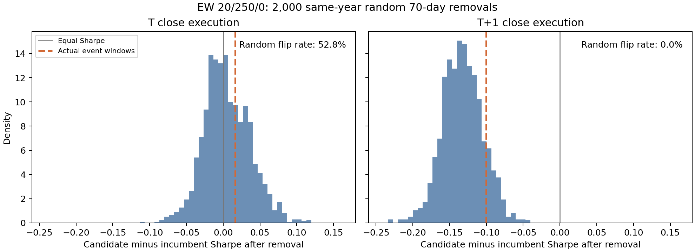

# 事件依赖第二轮：哪些值得重审？

分析日期2026-09-15，价格截至2026-09-11。全部沿用r1冻结数据，不改现役、不重扫参数。本轮复核25个主窗口夏普反转规格，另加20日窗口中出现双指标反转的一组既有权重，共26个规格。未补齐r1的8项数值覆盖缺口。

## 核心结论

**上一轮的25个夏普反转不能直接成为25个“被事件错杀”的信号。** 24个涉及不同持仓结构；放回同多头基准后，事件中性夏普全部仍较差。剩余同类EW 20/250/0的轻微反转，在随机移除行情时也很常见，而且对执行时间敏感。

据此，本轮没有新增“事件剔除后应替换现役”的候选。保留两项敏感性观察：EW 20/250/0和原四对权重(2/7,1/7,2/7,2/7)。这不是证明所有未采用信号无效，也不是宣布现役参数最优。

## 1. 先把持仓结构放在同一把尺子上

上一轮25个规格中，24个是历史多头/空仓候选相对当前EW多空对称的反转。它们相对EW多头版本：

- 原全期夏普全部较低；
- 同样去掉70个事件窗口交易日后，夏普仍全部较低，差距为0.161—0.253；
- 因而不能用“相对多空现役反转”证明多头信号被事件错杀。

例如Hamilton多头剔事件后相对EW对称夏普+0.0357，但相对EW多头是−0.2156；单1000配对分别为+0.0422和−0.2091。这些是不同基准，不是数字矛盾。

收益上另作逐日精确分解：候选多头−EW对称 =（候选多头−EW多头）−EW空头腿。持仓、carry和交易成本均纳入。结果存入long_signal_vs_short_leg.csv。该拆分是简单日收益的加总，不能与复利对数收益混加。累计收益必须更高并非低风险策略有价值的必要条件；本轮排查的关键是同映射表现与原否决门槛。

## 2. 81.4%事件依赖，并不等于81.4%没猜中新闻

重点EW 20/250/0的原相对对数收益差为−0.121642。按发生时间拆开：

|差距发生在哪里|占全部相对落后的比例|
|---|---:|
|七项冲击首日|22.7%|
|七项各自后9个交易日|58.6%|
|事件窗口之外|18.6%|

首日+后9日等于上一轮的81.4%。首日是A股反应锚日，包含全天收益，并非单独隔夜新闻跳空；后续也仍可包含事件影响。这里不能把“后9日”都解释成可预测收益。

|事件|候选/现役事前仓位|首日相对对数收益差|后9日差|事后仓位说明|
|---|---|---:|---:|---|
|tariff_20180323|+1 / +1|+0.000|+0.000||
|tariff_20180619|-1 / -1|+0.000|+0.000||
|tariff_20190506|-1 / -1|+0.000|-2.266|初始都空，候选5/13开始变化|
|tariff_20190802|+1 / -1|-2.764|-6.913|现役7/25已转空，8/7转多；候选6/12以来持多|
|policy_20240924|+1 / +1|+0.000|+0.000||
|tariff_20250403|-1 / -1|+0.000|+0.000||
|geneva_20250512|+1 / +1|+0.000|+2.047|初始都多，候选5/15开始变化|

表中收益差单位为相对对数收益×100，负号表示候选落后，非简单百分比回报差。事前仓位的“生效日期”来自完整逐日账本，例如现役2019-07-25转空对应此前收盘信号。

2019年8月窗口最关键：现役冲击前已持空，随后8/7转多；候选一直持多。收益差同时包含初始方向与后续调整。按10日窗口简单收益差拆解，七事件合计：

|加总贡献（候选−现役）|简单收益百分点|
|---|---:|
|事前仓位差若维持不动产生的市场收益差|-6.969|
|双方事后相对事前仓位的变化贡献|-2.583|
|carry差|-0.045|
|成本差|-0.300|
|净差合计|-9.897|

这与上面的首日/后续日是两种切法，不能相加。冻结仓位贡献包含后续延续行情，不能证明是“运气”；响应贡献也不能证明系统识别了政策文本。双方是否提前掌握或理解新闻，不在数据里。

9.24和2025年4月窗口两者事前方向与窗口收益相同，均不是这个规格相对落后的来源。

## 3. 随机移除行情：这个排名反转是否特殊？

在相同年份随机取七段10日行情，年内段数保持2018两段、2019两段、2024一段、2025两段。同次不重叠、共70日，不跨年；每次所有候选采用相同日期，可覆盖真实事件。固定种子20260915，2000次。只对覆盖2018—2025完整年份的696组当前EW对称比较执行。

EW 20/250/0结果：

|指标|T收盘执行|次日收盘执行|
|---|---:|---:|
|原夏普差|−0.0158|−0.1533|
|真实事件窗口置零后夏普差|+0.0163|−0.1001|
|随机窗口置零后夏普反转比例|52.8%|0/2000|
|随机窗口置零后夏普与累计收益同时反转比例|27.3%|0/2000|
|随机窗口中相对收益损失不小于真实事件窗口的比例|34.25%|10.30%|

因此，在T收盘口径，真实事件造成的小幅夏普反转不是稀有现象；换成次日收盘执行，真实窗口和本次2000个随机窗口都没有反转。0/2000不等于理论概率为0。

不能把上述结论推广成“所有事件效应都不特殊”：在319个跨映射比较中，真实窗口有24个夏普反转，随机窗口的反转数中位数为4个；一些候选的真实事件损失也明显集中。这说明事件期的不同仓位结构确实重要，但这些候选仍未超过同多头基准。完整696组随机分布保留，未只展示有利案例。

上述比例是**事后随机日历诊断，不是显著性p值**：未校正候选挑选、事件清单选择或历史复用；事件发生日期也不能被视为随机分配。它只检验“同样移除70个交易日，排名变化是否常见”。

## 4. 原否决理由和重审清单

|对象|原否决/未采用的含义|本轮处理|
|---|---|---|
|EW 20/250/0|原网格未选参数；早期20/40/5选择轨迹不完整，不能虚构逐参数否决记录|保留为排名敏感、执行敏感的观察项；不据此升格|
|权重(2/7,1/7,2/7,2/7)|原权重族未通过选择校正；该行是上一轮20日窗口敏感对象|10日主窗口不反转；随机70日夏普反转39.45%，次日收盘仅0.65%；仍属脆弱排序|
|配对集合B/C、红利伙伴|原基准为long-flat；独立IC闸未过，收益要求worst(train,val)至少+0.15且换手/集中度不恶化|同多头基准未领先；不能将原2021—2023收益门槛失败归咎2024/2025事件|
|分批建仓|原为long-flat探索；验证期优势集中、收益回撤和进出机制均参与判断|四个本次反转规格在同多头基准仍较差；不是一次总收益排序即可推翻|
|动量、阈值、B2|原门槛涉及跨期、独立信息或选择校正；本轮反转行不一定是原代表|未发现因事件剔除而推翻原门槛的证据|
|raw/DEMA/Hamilton固定生成器|原预筛描述性，后续固定回放未形成替换依据|不冒称原正式STOP；继续作为既有对照|

原“被否决研究”和单一网格行并非同一单位。完整26行的原研究关联、同映射差距和复核说明见rejection_review.csv。此次没有重新执行原IC检验或全套选择校正，也没有给历史裁决补发统计证明。

## 5. 新维度怎样使用

事件依赖应当是一组诊断列，而不是一个越低越好的总分：

1. 同映射下事件前后排名，避免混入多空结构差异；
2. 事件相对损失占比，同时列原差距，避免接近零的分母放大比例；
3. 冲击首日、后续持仓响应和carry/成本分开；
4. 与同年随机窗口比较，识别一般性的样本敏感；
5. 5/10/20日窗口及两种执行时点的一致性；
6. 回到原训练/验证门槛，并等待真正新增的后续数据。

当前适合形成“重审优先级”，不足以挑出一个可替代现役的新赢家。不能从表现依赖事件推出纯运气，也不能从事件敏感性不强推出未来有效。

## 验证与范围

核对10份r1冻结输入哈希；分解26规格×7事件×2执行时点，共364条，逐日恒等式最大误差1.27e-17。随机日历2000次均为七段70日、年内段数一致；两种执行时点共18组直接重算验证向量统计，最大误差1.11e-15。另核对EW对称收益等于多头腿加空头腿，最大误差1.39e-17。

年度表零波动年份夏普保留为空，不赋予0。本轮不是独立样本外验证；不补齐r1未覆盖的8项研究、不新增宏观事件、不改生产。Excel和CSV均提供，随机日历与重点候选全部2000次结果可重查。方案见inputs/design.md。
